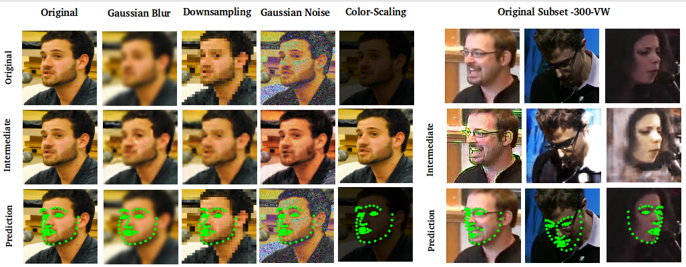

# FADeNN
This is The Repository of coming soon 

Requirements : 
1. MTCNN requirements : https://github.com/DuinoDu/mtcnn
2. Tensorflow GPU : https://www.tensorflow.org/install/install_linux
3. Pytorch GPU : https://pytorch.org/
3. Other packages, can be installed by cloning my environment file on src : env.yml

This Repository hold the Facial Localiser from this repo : https://github.com/deckyal/RT

<b> Example of the facial alignment </b>

<b>usage : </b>

python DenoiseLocalise.py

<b> Change : </b>
config.py : 

-img_name = 'indoor_120.png' #Your image name
-trySynthetic = True/False #Whether to provide the demo on the synthetic or real data(300VW)
-image_directory = 'ex_images' #the directory of the image
-cl_type = 0#0,1,2 the type of denoising. 

Citation : 
coming soon
